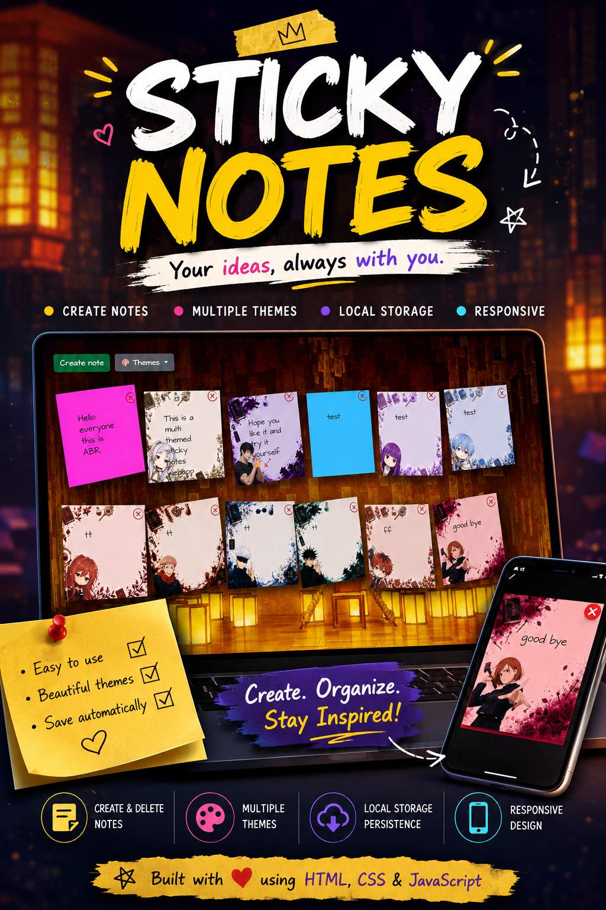

# 📝 Sticky Board

Sticky Board is a customizable sticky notes application built with JavaScript, CSS, and Bootstrap.

Create notes, switch between unique themes, and keep everything saved automatically using LocalStorage.

visit site : https://stickyboard00.netlify.app/

## Features 🌐🌸

- 📝 Create and delete notes
- 🎨 Multiple custom themes
- 🖼️ Theme-specific note skins
- 💾 Persistent storage with LocalStorage
- 📖 Note preview modal
- 🎵 Sound effects
- 📱 Responsive design

## Tech Stack 🚀

- HTML
- JavaScript
- CSS3
- Bootstrap 5
- Vite

## Installation

```bash
git clone https://github.com/abrvion/sticky_board.git
cd sticky_board
npm install
npm run dev
```

## Demo Reel

[](https://www.instagram.com/abrvion/reel/DZALmKvzMzM/)

## Author

Abrvion
